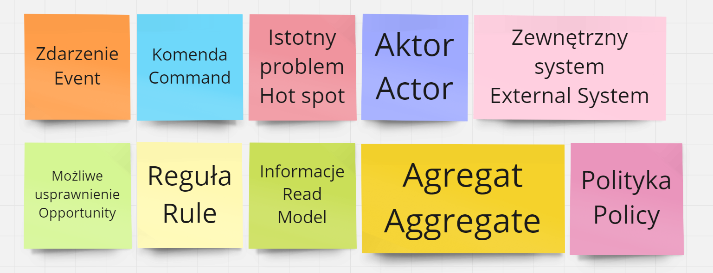
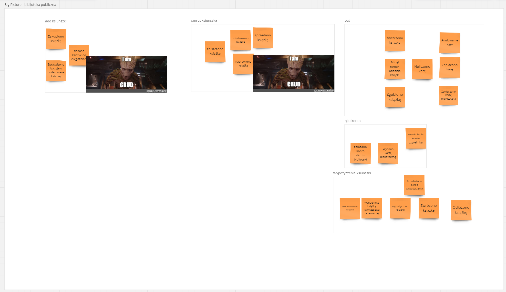

# Big Picture - poznawanie z oddali
Podczas tego etapu skupiliśmy się na:
- poznaniu kontekstu systemu bibliotecznego,
- poznaniu ryzyk i wyzwań,
- określeniu złożoności domeny,
- wyznaczeniu procesów biznesowych jako wstępu Process Level.

## Agenda
Do wszystkich etapów potrzebna będzie agenda mówiąca jaka kartka co oznacza, w związku z tym ustaliliśmy agendę.

## Cel warsztatu
Podzielił bym tą kategorię na dwie osobne:
 - Rozpoczeliśmy je chcąc nauczyć się odkrywania procesów biznesowych, i zdobycia doświadczenia z Event Stormingiem.
 - Dlatego też postawiliśmy sobie cel zbadania procesów biznesowych biblioteki. I tym na czym się skupiamy to jak najlepsze zaprojektowanie systemu bibliotecznego.

## Zdarzenia
Na tym etapie zrobiliśmy burzę muzgów i dodawaliśmy karteczki opisujące zdarzenia:
 - zakupiono książkę
 - dodano książkę do księgozbioru
 - sprowadzono i przyjęto książkę
 - zniszczono książkę
 - anulowano karę
 - minął termin oddania książki
 - maliczono karę
 - zaplacono karę
 - zgubiono książkę
 - zawieszono kartę biblioteczną
 - zutylizowano książkę
 - sprzedano książkę
 - naprawiono książkę
 - założono konto czytelnika
 - wydano kartę biblioteczną
 - zamknięcie konta czytelnika
 - zarezerwowano książkę
 - wyciągnięto książkę
 - wypożyczono książkę
 - przedłużono okres wypożyczenia
 - zwrócono książkę
 - odłożono książkę

