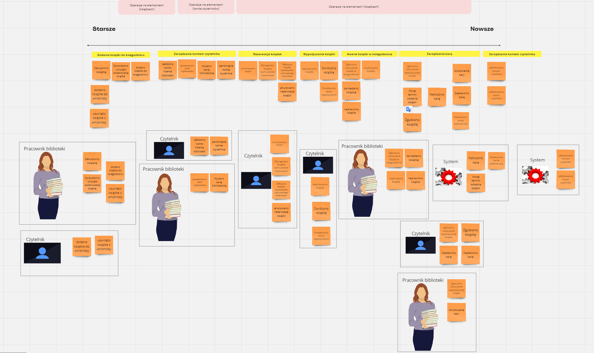

# Big Picture - poznawanie z oddali
Podczas tego etapu skupiliśmy się na:
- poznaniu kontekstu systemu bibliotecznego,
- poznaniu ryzyk i wyzwań,
- określeniu złożoności domeny,
- wyznaczeniu procesów biznesowych jako wstępu Process Level.

## Agenda
Do wszystkich etapów potrzebna będzie agenda mówiąca jaka kartka co oznacza, w związku z tym ustaliliśmy agendę.

## Cel warsztatu
Podzielił bym tą kategorię na dwie osobne:
 - Rozpoczeliśmy je chcąc nauczyć się odkrywania procesów biznesowych, i zdobycia doświadczenia z Event Stormingiem.
 - Dlatego też postawiliśmy sobie cel zbadania procesów biznesowych biblioteki. I tym na czym się skupiamy to jak najlepsze zaprojektowanie systemu bibliotecznego.

## Zdarzenia
Na tym etapie zrobiliśmy burzę muzgów i dodawaliśmy karteczki opisujące zdarzenia:
 - zakupiono książkę
 - dodano książkę do księgozbioru
 - sprowadzono i przyjęto książkę
 - zniszczono książkę
 - anulowano karę
 - minął termin oddania książki
 - maliczono karę
 - zaplacono karę
 - zgubiono książkę
 - zawieszono kartę biblioteczną
 - zutylizowano książkę
 - sprzedano książkę
 - naprawiono książkę
 - założono konto czytelnika
 - wydano kartę biblioteczną
 - zamknięcie konta czytelnika
 - zarezerwowano książkę
 - wyciągnięto książkę
 - wypożyczono książkę
 - przedłużono okres wypożyczenia
 - zwrócono książkę
 - odłożono książkę

## Oś czasu
Po uzbieraniu zdarzeń wprowadzono oś czasu, i uporządkowano zdarzenia od najstarszego do najmłodszego.
Gdy zdarzenia które mieliśmy znalazły się na osi czasu, prześledziliśmy je od końca sprawdzając czy zaszły wszystkie inne zdarzenia potrzebne do wystąpienia obecnego.

## Źródło zdarzeń
Gdy wiedzieliśmy kiedy zachodzi jakie zdarzenie skupiliśmy się na wskazaniu kto wywołuje dane zdarzenie.

Dodatkowo na tym etapie jeszcze raz patrząc po czasie uznano że warto przedyskutować i zmienić:
 - zniszczono wypożyczoną książkę -> zgłoszono zniszczenie wypożyczonej książki
 - zniszczono książkę (nie wykryty sprawca) -> zgłoszono zniszczenie książki w księgozbiorze
 - dodano zdarzenie "odblokowano konto czytelnika"

## Istotne problemy
Gdy mamy już wszystko uporządkowane oraz przypisanych aktorów przyszedł czas na wypisanie istotnych problemów(tzw. hotspot's):
 - W jakich przypadkach czytelnik ma mieć blokowane konto użytkownika? - czy te reguły mogą się zmieniać?
 - W jakich przypadkach czyteknik ma mieć odblokowane konto użytkownika? - cz te reguły mogą się zmieniać?
 - Czy anulowanie kary powinno być akceptowane przez kogoś ważnego w bibliotece? Czy może to zależeć od biblioteki i wynikać z ustawień?
 - W jakich przypadkach może zostać zawieszona karta biblioteczna? - czy te reguły mogą się zmieniać?
 - Czy termin oddania książki będzie z góry ustalony czy powinien wynikać z ustawień systemu?
 - Czym się różni zniszczenie książki w księgozbiorze/czytelni od wypożyczonej książki?
 - Czy przedłużenie okresu wypożyczenia książki ma limit? jeśli tak to jaki? czy wynika on z ustawień systemu?
 - jakie książki można rezerwować? - czy te reguły mogą się zmieniać?
 - jakie książki można wyciągać tzn zabierać do czytelni? - czy te reguły mogą się zmieniać?
 - jakie warunki muszą być spełnione aby można było wydać kartę biblioteczną? - czy te reguły mogą się zmieniać?
 - na potwierdzeniu jakich danych czytelnika nam zależy? - czy reguły to określające mogą się zmieniać?

## Pomysły i możliwości
Gdy znamy już problemy i przeszkody czas wypisać i zaznaczyć pomysły i możliwości(tzw. opportinity):
 - reguły które mogą ewoluowac warto sobie oznaczać aby umieszczać je w osobnych modułach funkcyjnych ułatwiając ich rozbudowywanie w przyszłości
 - elementy zależne od konfiguracji systemu można spróbować ująć osobnymi procesami biznesowymi tworząc dla nich pojedyńcze źródło prawdy
 - sprawdzanie terminów wypożyczeń które minęły można oprzeć na harmonogramie procesów, podczas wyporzyczenia dodawać do harmonogramu zadanie triggerujące dalsze akcje w przypadku nie usunięcia go podczas zwrotu ksiązki
 - naliczanie kary wygląda jak czysta funkcja więc można zaimplementować to jako prosty element funkcyjny
 - płatność kar można oprzeć na dowolnym systemie zewnętrznym, a dla przyszłościowej opcji zmiany można otoczyć go własną abstrakcją