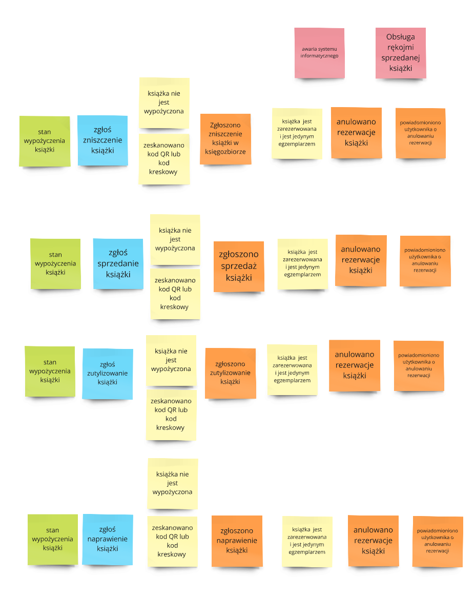

# Process Level - poznawanie procesów
Podczas tego procesu skupiliśmy się na:
 - zwalidowaniu scenariuszy i przypadku użycia podczas sortowania karteczek
 - odnalezieniu biznesowych subdomen
 - przypisanie ryzyk i wyzwań do procesów
 - odnalezienie granic modularyzacji (żródła prawdy i zbiory reguł)

## Dodanie poleceń


Uwagi dodatkowe:
 - zakupiono książkę -> zgłoszono zakupienie książkę
 - Sprawdzono i przyjęto podarowaną książkę -> zgłoszono sprawdzenie i przyjęcie podarowanej książki
 - założono konto klienta biblioteki -> założono konto czytelnika
 - potwierdzono dane użytkownika -> potwierdzono dane czytelnika
 - Wyciągnięto książkę (tymczasowa rezerwacja) -> wyciągnięto książkę do czytelni
 - Odłożono książkę (anulowanie tymczasowej rezerwacji) -> zwrócono książkę z czytelni
 - zmieniono naprawiono książkę -> zgłoszono naprawienie książki
 - zutylizowano książkę -> zgłoszono zutylizowanie książki
 - sprzedano książkę -> zgłoszono sprzedaż książki
 - Zgubiono książkę -> zgłoszono zgubienie książki

## Dodanie reguł
W miejscach gdzie nie wiadomo czy proces ma być kontynuowany dodano reguły które muszą być sprawdzone

Uwaga dodatkowa:
 - zauważono brakujące zdarzenie "dodano raport podarowanej książki"
 - zauważono brakujące zdarzenie "odebrano formularz z prośbą założenie konta czytelnika"
 - zauważono brakujące zdarzenie "zapisano ustawienie systemowe"
 - zauważono brakujące zdarzenie "powiadomiono użytkownika o anulowaniu rezerwacji"
 - zauważono brakujące zdarzenie "powiadomiono użytkownika o rozpoczęciu rezerwacji"
 - zauważono brakujące zdarzenie "powiadomienie użytkownika że zarezerwowana książka czeka na odbiór"
 - zauważono brakujące zdarzenie "zapisano osobę która anulowała karę"

Postanowienia:
 - Zastanawialiśmy się czy traktować książki jako pojedyncze rekordy w tabeli, czy jako pozycje mające ilość sztuk - postanowiliśmy potraktować każdy egzemplarz jako osobny byt, a po fazie MVP jeśli będzie taka potrzeba przeprowadzić normalizację.


## Dodaj modele odczytu
Zastanowiliśmy się jak powinien wyglądać model odczytu, i w których miejscach go potrzebujemy.

- Model odczytu powinien znajdować się przed komendą.
- Model odczytu to dane które będą zasilać komendę z zewnętrz lub z systemu

Dodano modele odczytu:
- odczyt ilości przedłużeń okresu wypożyczenia
- raport z dodanej książki
- whislista
- formularz założenia konta czytelnika - x2
- konto czytelnika - x2
- kary użytkownika - x3
- wypożyczenia użytkownika
- książka
- stan wypożyczenia książki - x5
- termin oddania książki
- lista kar - x2
- lista kar użytkownika - x4


Zmiany dodatkowe:
- dodanie frame'ów w miro aby historycznie widać było od razu jakie zmiany zachodziły na danym obszarze
## Ryzyka i wyzwania
W naszym przypadku będą to istotne problemy zgodnie z agendą.

- Genetyczność raportów - niektóre raporty mogą potrzebować pól których nie przewidzieliśmy na początku
- rezerwacja książki przez kilka osób w tym samym momencie
	- udzielenie pierwszeństwa osobie starszej na podstawie nr pesel w danych konta
	- wywalenie wszystkich i zobaczyć kto znów będzie pierwszy :D
- zabierając książkę do czytelni lub wypożyczając nie zauważono że jest ona zniszczona - generując problem z zwrotem
	- zainwestowanie w dobre kamery na terenie biblioteki, oraz przy weryfikacji książki dodanie procedury przekartkowania książki pod kamerę aby móc ustalić czy już usterka była
	- dodawanie znaczników czasowych aby łatwiej weryfikować kamery
	- zintegrowanie systemu kamer z systemem bibliotecznych
- termin wypożyczenia staje się niemożliwy przez jakąś katastrofę bądź okres świąteczny
	- automatyczne przedłużanie terminu gdy np.:
		- spadł śnieg i nie jest możliwe dojście do biblioteki (nagła klęska)
		- biblioteka nie jest czynna z powodu jakiejś niezaplanowanej awarii (awaria biblioteki)
		- zostały nagle ustawione dni świąteczne w ostatnie dni terminu (nagłe święta)
- awaria systemu informatycznego
	- możliwość prowadzenia wypożyczeń i zwrotów jako eventy do wprowadzenia na kartkach/zeszytach z opcją wprowadzenia ich później\
- Obsługa rękojmi sprzedanej książki
	- Odnotowanie i zarejestrowanie stanu książki przed wydaniem kupującemu + podpisany protokół odbioru
```Kwestie związane z rękojmią zostały uregulowane w ustawie z dnia 23 kwietnia 1964 roku **Kodeks cywilny**. Zgodnie z _**art. 556** tejże ustawy_ **sprzedawca ponosi odpowiedzialność wobec kupującego za wady fizyczne oraz prawne sprzedanej rzeczy.** Z ustawy nie wynika, czy zbyta rzecz musi być nowa, czy może też być używana, dlatego nic nie stoi na przeszkodzie, aby rękojmia obejmowała również rzeczy używane.```
- Zgubienie książki której nie da się już kupić
	- Stworzenie funkcjonalności sprawdzającej dostępność książek i wysyłających notyfikację z radą aby przenieść książkę tylko do czytelni gdy nie da się jej dokupić 
- Jak naliczać karę? są książki które z czasem zwiększają wartość
	- można rejestrować zmiany cen książek dostępnych do zakupów albo mieć estymaty aktualnych wartości w systemie


Z hotspotu wynikły reguły(hot spot -> reguła)
- Wrzucenie tej samek książki kilka razy do whishlisty spowoduje bałagan w liście -> dodawana książka nie jest obecna w whishliście

Przy okazji zauważono też możliwe usprawnienia które dodano:
- możliwość implementacji potwierdzenia danych kontem bankowym





## Wyznaczenie źródeł prawdy

Zaczęliśmy od intuicyjnego wymienienia źródeł prawdy, były to:
- wypożyczenia
- książki
- użytkownicy
- kary

Później zauważyliśmy że nasze źródła prawdy są bardzo powiązane z read modelami, po czym zauważyliśmy że dobrze było by mieć whisliste z osobnym źródłem prawdy.

